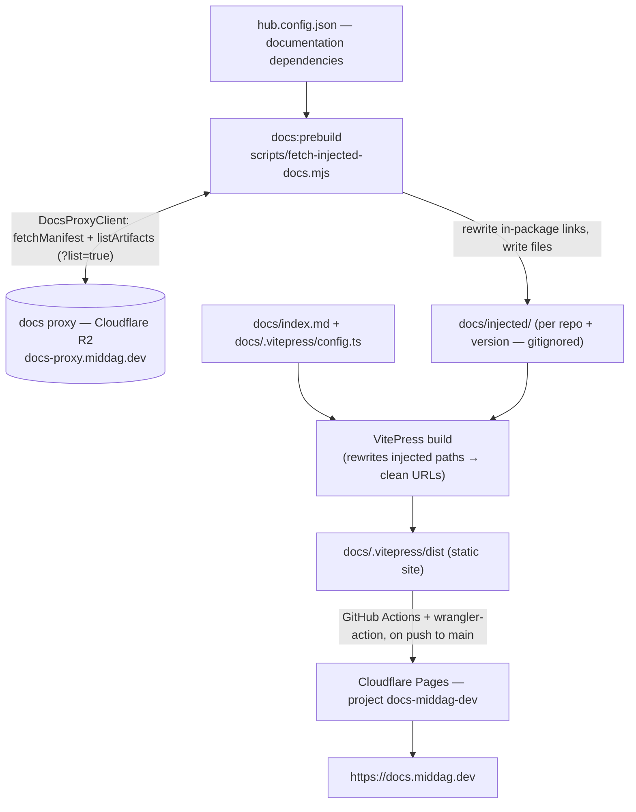

# docs-middag-dev

MIDDAG's unified documentation hub. A [VitePress](https://vitepress.dev) static
site that aggregates the documentation of MIDDAG libraries **at build time** and
publishes it to Cloudflare Pages at **<https://docs.middag.dev>**.

This repository contains **no library documentation of its own**. Following
**ADR-016 (Build-Time Aggregation via Edge Storage)**, each library publishes a
versioned documentation payload to the MIDDAG docs proxy (a Cloudflare Worker in
front of an R2 bucket). At build time this hub pulls those payloads, injects them
into the VitePress source tree, and compiles a single static site.

## Architecture



### How it works

1. **Manifest** — `hub.config.json` is the explicit, reviewable list of which
   library and version the hub documents.
2. **Fetch & inject** (`scripts/fetch-injected-docs.mjs`, run as `docs:prebuild`):
   - Uses `@middag-io/docs-proxy-client` to `fetchManifest()` (sanity/drift check)
     and `listArtifacts()` to **discover** the doc set — no filenames are
     hardcoded. The proxy enumerates files via its `?list=true` endpoint.
   - Downloads every file (including subdirectories) into
     `docs/injected/{repo}/{version}/`.
   - **Rewrites in-package links** so they survive the URL remap: root-absolute
     Markdown links `](/x)`, inline `href="/x"`, and home-layout frontmatter
     `link:` fields become `/{repo}/x`. External, anchor, and relative links are
     left untouched.
3. **Build** — VitePress compiles the site. A `rewrites` function maps
   `injected/{repo}/{version}/**` → `/{repo}/**`, so the physical folder and the
   version are hidden from public URLs (e.g. `/middag-react/getting-started`).
4. **Deploy** — GitHub Actions builds and ships `docs/.vitepress/dist` to
   Cloudflare Pages on every push to `main`.

`docs/injected/` is **gitignored** — it is reproduced on every build and never
committed. The proxy manifest lists only the *latest* version, so the injector
treats a pin-vs-latest mismatch as a warning (real availability is enforced by
`listArtifacts`), not a failure.

## Project layout

```
docs-middag-dev/
├─ .github/workflows/deploy.yml      # CD → Cloudflare Pages
├─ docs/
│  ├─ .vitepress/config.ts           # VitePress config: rewrites, nav, sidebar, sitemap
│  ├─ index.md                       # hub homepage
│  └─ injected/                      # generated at build time (gitignored)
├─ scripts/fetch-injected-docs.mjs   # build-time documentation injector
├─ hub.config.json                   # documentation dependency manifest
├─ .npmrc                            # maps the @middag-io scope to GitHub Packages
└─ package.json
```

## Local development

**Prerequisites**

- Node.js ≥ 20 (CI runs Node 22).
- Read access to the `@middag-io` packages on GitHub Packages. The committed
  `.npmrc` reads the token from `NODE_AUTH_TOKEN`:
  ```bash
  export NODE_AUTH_TOKEN=<GitHub PAT with read:packages>
  ```

**Run**

```bash
npm ci
npm run docs:dev        # prebuild (fetch docs) + dev server with HMR
```

The `docs:prebuild` step reaches the **public** docs proxy anonymously — no
`DOCS_PROXY_TOKEN` is needed. Set `DOCS_PROXY_TOKEN` only when targeting the
private proxy deployment.

## Scripts

| Script          | What it does                                                       |
| --------------- | ------------------------------------------------------------------ |
| `docs:prebuild` | Fetch and inject library docs from the proxy into `docs/injected/` |
| `docs:dev`      | `docs:prebuild`, then the VitePress dev server                     |
| `docs:build`    | `docs:prebuild`, then build the static site to `docs/.vitepress/dist` |
| `docs:preview`  | Serve the built site locally                                       |

## Adding a library to the hub

1. Add it to `hub.config.json`:
   ```json
   { "dependencies": { "middag-react": "0.20.0", "another-lib": "1.2.0" } }
   ```
2. Add a `nav`/`sidebar` entry in `docs/.vitepress/config.ts` pointing at the
   clean URL `/{repo}/` (the prebuild discovers and injects the files; the
   `rewrites` function serves them there).

The library must publish a `docs` payload to the proxy (see ADR-016 and each
library's `prepare-docs-payload` step).

## Deployment

CD is defined in [`.github/workflows/deploy.yml`](.github/workflows/deploy.yml):
on push to `main` (or manual `workflow_dispatch`) it installs, runs
`docs:build`, and deploys `docs/.vitepress/dist` to the Cloudflare Pages project
`docs-middag-dev` via `cloudflare/wrangler-action@v3`.

**Required repository configuration**

| Name                    | Type   | Purpose                                              |
| ----------------------- | ------ | ---------------------------------------------------- |
| `CLOUDFLARE_API_TOKEN`  | secret | Cloudflare token with **Pages: Edit**                |
| `CLOUDFLARE_ACCOUNT_ID` | var    | Target Cloudflare account                            |
| `NODE_AUTH_TOKEN`       | secret | *(optional)* PAT with `read:packages`; falls back to `GITHUB_TOKEN` when the `@middag-io` packages grant this repo read access |

## References

- **ADR-016** — Build-Time Aggregation via Edge Storage.
- [`worker-ts-middag-docs-proxy`](https://github.com/middag-io/worker-ts-middag-docs-proxy)
  — the docs proxy (Cloudflare Worker + R2) and the `@middag-io/docs-proxy-client`
  / `@middag-io/docs-theme` packages.
- [VitePress](https://vitepress.dev) · [Cloudflare Pages](https://developers.cloudflare.com/pages/)
