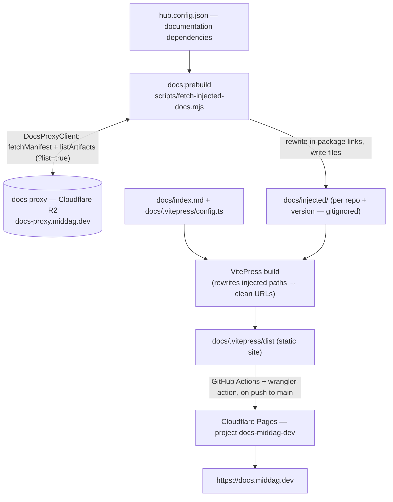

# docs-middag-dev

MIDDAG's unified documentation hub. A [VitePress](https://vitepress.dev) static
site that aggregates the documentation of MIDDAG libraries **at build time** and
publishes it to Cloudflare Pages at **<https://docs.middag.dev>**.

This repository contains **no library documentation of its own**. Following
**ADR-016 (Build-Time Aggregation via Edge Storage)**, each library publishes a
versioned documentation payload to the MIDDAG docs proxy (a Cloudflare Worker in
front of an R2 bucket). At build time this hub pulls those payloads, injects them
into the VitePress source tree, and compiles a single static site.

## Architecture



### How it works

1. **Allowlist** — `hub.config.json` is the explicit, reviewable list of which
   libraries the hub documents and, per library, which **channels** (versions)
   are published. Nothing appears on the site unless declared here — adding a
   channel IS the deliberate publish action (an operational workflow step).
2. **Fetch & inject** (`scripts/fetch-injected-docs.mjs`, run as `docs:prebuild`):
   - Discovers the retained versions per repo via the proxy `?list=true`
     endpoint and resolves each declared channel selector to a concrete version:
     `latest` → the manifest's newest, `0.30.x` → highest retained `0.30.*`, or
     an exact pin. No filenames or versions are hardcoded.
   - Downloads every file (including subdirectories) into
     `docs/injected/{repo}/{segment}/`, one folder per channel (segment:
     `latest` stays `latest`; `0.30.x` → `0.30`).
   - **Rewrites in-package links** so they survive the URL remap: root-absolute
     Markdown links `](/x)`, inline `href="/x"`, and home-layout frontmatter
     `link:` fields become `/{repo}/{segment}/x`. External, anchor, and relative
     links are left untouched.
   - Writes `docs/injected/{repo}/_channels.json` (label + resolved channels)
     for the config to build the nav, sidebars and version switcher.
3. **Build** — VitePress compiles the site. `docs/.vitepress/config.ts` reads
   the injected tree + `_channels.json` and generates, **fully dynamically**, a
   per-repo version-switcher dropdown and a per-channel sidebar. A `rewrites`
   function maps `injected/{repo}/{segment}/**` → `/{repo}/{segment}/**`, giving
   versioned URLs (e.g. `/middag-react/0.30/getting-started`).
4. **Deploy** — GitHub Actions builds and ships `docs/.vitepress/dist` to
   Cloudflare Pages on every push to `main`.

`docs/injected/` is **gitignored** — reproduced on every build, never committed.

## Project layout

```
docs-middag-dev/
├─ .github/workflows/deploy.yml      # CD → Cloudflare Pages
├─ docs/
│  ├─ .vitepress/config.ts           # VitePress config: rewrites + DYNAMIC nav/sidebar/switcher
│  ├─ index.md                       # hub homepage
│  └─ injected/                      # generated at build time (gitignored)
├─ scripts/fetch-injected-docs.mjs   # build-time documentation injector (multi-channel)
├─ hub.config.json                   # publish allowlist: repos → label + channels
├─ .npmrc                            # maps the @middag-io scope to GitHub Packages
└─ package.json
```

## Local development

**Prerequisites**

- Node.js ≥ 20 (CI runs Node 22).
- Read access to the `@middag-io` packages on GitHub Packages. The committed
  `.npmrc` reads the token from `NODE_AUTH_TOKEN`:
  ```bash
  export NODE_AUTH_TOKEN=<GitHub PAT with read:packages>
  ```

**Run**

```bash
npm ci
npm run docs:dev        # prebuild (fetch docs) + dev server with HMR
```

The `docs:prebuild` step reaches the **public** docs proxy anonymously — no
`DOCS_PROXY_TOKEN` is needed. Set `DOCS_PROXY_TOKEN` only when targeting the
private proxy deployment.

## Scripts

| Script          | What it does                                                       |
| --------------- | ------------------------------------------------------------------ |
| `docs:prebuild`   | Fetch and inject the declared channels from the proxy into `docs/injected/` |
| `docs:dev`        | `docs:prebuild`, then the VitePress dev server                        |
| `docs:dev:nofetch`| Dev server against the already-injected tree (skips the proxy fetch)  |
| `docs:build`      | `docs:prebuild`, then build the static site to `docs/.vitepress/dist` |
| `docs:preview`    | Serve the built site locally                                          |
| `docs:available`  | Read-only discovery: list repos/versions in the proxy and diff against the allowlist |

## Publishing a library / version to the hub

`hub.config.json` is the allowlist. Declare the repo, a friendly `label`, and
the `channels` to publish (order = display order; the first is the default):

```json
{
  "repos": {
    "middag-react": { "label": "MIDDAG React", "channels": ["latest", "0.30.x", "0.20.x"] },
    "another-lib":  { "label": "Another Lib",  "channels": ["latest"] }
  }
}
```

Channel selectors: `latest` (proxy manifest's newest), `MAJOR.MINOR.x` (highest
retained patch of that line), or an exact `X.Y.Z` pin. Each becomes a versioned
URL `/{repo}/{segment}/` and an entry in that repo's version-switcher dropdown.
**No config.ts edit is needed** — nav, sidebars and switcher are generated from
the injected tree. The library must publish a `docs` payload to the proxy (see
ADR-016 and each library's `prepare-docs-payload` step). To unpublish a version,
remove its channel here — allowlist is default-hidden.

## Deployment

CD is defined in [`.github/workflows/deploy.yml`](.github/workflows/deploy.yml):
on push to `main` (or manual `workflow_dispatch`) it installs, runs
`docs:build`, and deploys `docs/.vitepress/dist` to the Cloudflare Pages project
`docs-middag-dev` via `cloudflare/wrangler-action@v3`.

**Required repository configuration**

| Name                    | Type   | Purpose                                              |
| ----------------------- | ------ | ---------------------------------------------------- |
| `CLOUDFLARE_API_TOKEN`  | secret | Cloudflare token with **Pages: Edit**                |
| `CLOUDFLARE_ACCOUNT_ID` | var    | Target Cloudflare account                            |
| `NODE_AUTH_TOKEN`       | secret | *(optional)* PAT with `read:packages`; falls back to `GITHUB_TOKEN` when the `@middag-io` packages grant this repo read access |

## References

- **ADR-016** — Build-Time Aggregation via Edge Storage.
- [`worker-ts-middag-docs-proxy`](https://github.com/middag-io/worker-ts-middag-docs-proxy)
  — the docs proxy (Cloudflare Worker + R2) and the `@middag-io/docs-proxy-client`
  / `@middag-io/docs-theme` packages.
- [VitePress](https://vitepress.dev) · [Cloudflare Pages](https://developers.cloudflare.com/pages/)
